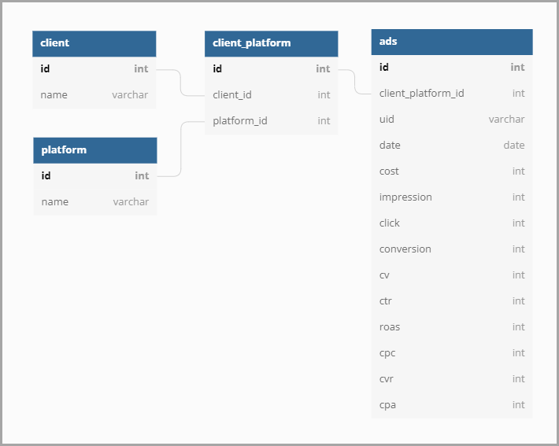

# Madup

<div align="center">
  
  
  
  
</div>

[//]: <app 추가되면 수정>

```bash
# tree -L 2 -d
.
├── __pycache__
├── advertisers
│   └── migrations
├── config
│   └── __pycache__
├── products
│   └── migrations
└── src
    ├── images
    └── reports

10 directories
```

## [Project Progress](https://github.com/orgs/PreOnboarding-Team-C/projects/1/views/2) [^kanban]

본 프로젝트에서는 None, Todo, In Progress, Done으로 나누어 공유가 가능하도록 합니다. 중요도는 상황에 따라 상대적으로 부여될 수 있기에, 담당자의 판단 하에 priorities를 설정해주시길 바랍니다.

## Contexts
* [Tasks](#tasks)
* [Rules](#rules)
* [Roles](#roles)

---
### Tasks
#### Infos
* Terms 
  * CTR(Click-Through Rate): 광고 노출 대비 클릭률 = click * 100 / impression 
  * ROAS(Return On Advertising Spend): 광고비 대비 매출액 = cv [^1] * 100 / cost
  * CPC(Cost Per Click): 클릭 당 광고비 = cost / click
  * CVR(Conversion Rate): 클릭 대비 전환율 = conversion * 100 / click
  * CPA(Cost Per Action): 전환 당 광고비 = cost / conversion

* DATASET
  | advertiser | uid | media | date | cost | impression | click | conversion | cv |
  |------------|-----|-------|------|------|------------|-------|-----------|----|

  주어진 데이터 셋의 칼럼명은 위와 같다.

  [simple analytics report](./src/reports/analytics_day1.md)를 참고하면, load 기준으로 부여된 index [78, 840, 940, 942, 24, 25, 891, 149, 191, 68840]가 중복됨을 확인할 수 있다. 이는 migration을 할 때 염두해야 할 내용이다.
  
* ERD
  

* Output
  ```shell
  1{
  2 "naver": {
  3 "ctr": 0.51,
  4 "cpc": 990.55,
  5 "roas": 265.38,
  6 "cvr": 8.33,
  7 "cpa": 881.01
  8 },
  9 "facebook": {
  10 "ctr": 0.51,
  11 "cpc": 990.55,
  12 "roas": 265.38,
  13 "cvr": 8.33,
  14 "cpa": 881.01
  15 },
  ```

---
### Rules
* Git Conventions [^3]
  ```shell
  # example of git conventions
  git commit -m "feat : get_user_infornation 추가
  
  광고주 정보 호출 기능을 ./advertiser/view.py 내 AdvertiserListView 클래스에 추가
  "
  ```
  * 팀 전원 push or pull request 이후, 리뷰를 진행하도록 한다.
  * 코드 실명제를 통해, assignee, reviewer 확인이 가능할 테지만 특정인의 리뷰 요청이 필요한 경우 issue에서 @{name}으로 호출한 뒤 review를 요청하도록 한다.
  * description은 1~3줄 내외로 작성하도록 한다.
  * title rules 
    * feat : 새로운 기능 추가
    * fix : 버그 수정
    * docs : 문서 수정
    * style : 코드 포맷팅, 세미콜론 누락, 코드 변경이 없는 경우
    * refactor : 코드 리팩터링
    * test : 테스트 코드, 리팩터링 테스트 코드 추가
    * chore : 빌드 업무 수정, 패키지 매니저 수정
  * branch rules
    * `feature/#{issue_no}-{short-description}` 예) `feature/#5-test-code`
    * 작업 전 issue 를 생성한다.(issue엔 assignees, labels, project, milestone이 포함되어야 함)
    * short description의 공백은 '-'로 대체하고, 3 단어 내외로 간단한 업무 설명을 영어로 기재한다.
    * branch의 head는 `main`으로, `main`에서 브랜치를 생성하고, `pull request` 요청 전 코드 리뷰를 받아야 한다.
    * 리뷰 요청에 따라 수정 혹은 동의를 얻을 시 `merge`가 가능하다.
    * `merge`후 local과 remote에 생성된 해당 브랜치는 삭제하도록 한다.
      ```bash
      git branch -D $BRANCH_NAME
      git push origin --delete $BRANCH_NAME
      ```
    * 생성했던 issue가 추가 설명이 필요하다고 판단되거나, 요청을 받으면 `./src/reports/`에 .md로 생성하고 issue를 종료한다.
  
* Code Conventions
  * class: Upper Camel Case ex) UserSerializer
  * function: snake_case ex) get_user_information()
  * DB table, columns: snake_case ex) advertiser_reports
  * 必) DB index 설정
  * 클래스 작성 및 수정 시, 클래스명 바로 하단에 여러 줄의 주석을 활용해, assignee, reviewer 정보 기입

---
### Roles
* 개발 환경 구축, 광고주 CRUD (assignee: [@Bruno-Jang](https://github.com/Bruno-Jang))
* 모델링, 조회(assignee: [@do-not-do-that](https://github.com/do-not-do-that))
* Migration, REST API 설계(assignee: [@castela0119](https://github.com/castela0119))
* 테스트 코드, 케이스 작성(assignee: [@AshbeeKim](https://github.com/AshbeeKim))

---

[//]: <가산점은 현재 고려사항이 아니기에 pass>

---
### Comments
[^kanban]: 통상적으로 backlog, in-progress, peer-review, in-test, done, blocked 로 구분해서 업무를 처리 과정에 따라 확인할 수 있는 보드를 칸반 보드라고 함. 간단하게 협업의 감을 익히기 위해 사용함.ref) [WIKIPEDIA | Kanban Board](https://en.wikipedia.org/wiki/Kanban_board) 
[^1]: cv([Conversion Value](https://www.investopedia.com/terms/c/conversion-value.asp))
[^2]: 용어로 설명된 내용은 광고 채널(매체) 별 광고 효용에 대한 지표를 얻을 수 있는 일종의 보고서와 같다. 출력 형태는 소숫점 둘째자리까지 출력(이하 버림)하도록 하고, Output을 참고하면 됨.
[^3]: [Git - 커밋 메시지 컨벤션](https://doublesprogramming.tistory.com/256)
