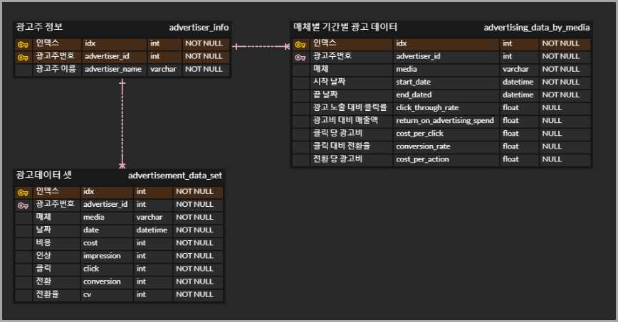

# Madup

<div align="center">
  
  
  
  
</div>

원티드에서 진행되는 프리온보딩 백엔드 코스 기업 과제 1주차로, "MADUP"이란 기업의 과제 해결을 위해 생성된 레포지토리입니다.

```bash
# tree -L 2 -d
.
├── __pycache__
├── config
│   └── __pycache__
└── src
    └── images

5 directories
```

## Contexts
* [Tasks](#tasks)
* [Rules](#rules)
* [Roles](#roles)

---
### Tasks
#### Infos
* Terms 
  * CTR(Click-Through Rate): 광고 노출 대비 클릭률 = click * 100 / impression 
  * ROAS(Return On Advertising Spend): 광고비 대비 매출액 = cv [^1] * 100 / cost
  * CPC(Cost Per Click): 클릭 당 광고비 = cost / click
  * CVR(Conversion Rate): 클릭 대비 전환율 = conversion * 100 / click
  * CPA(Cost Per Action): 전환 당 광고비 = cost / conversion

* DATASET
  * advertiser
  * uid
  * media
  * date
  * cost
  * impression
  * click
  * conversion
  * cv

주어진 데이터 셋의 칼럼명은 위와 같다.



* Output
  ```shell
  1{
  2 "naver": {
  3 "ctr": 0.51,
  4 "cpc": 990.55,
  5 "roas": 265.38,
  6 "cvr": 8.33,
  7 "cpa": 881.01
  8 },
  9 "facebook": {
  10 "ctr": 0.51,
  11 "cpc": 990.55,
  12 "roas": 265.38,
  13 "cvr": 8.33,
  14 "cpa": 881.01
  15 },
  ```
#### To-Do-List
* [ ] 광고주 정보를 담을 테이블 생성 후 Migration
* [ ] 광고주와 제공되는 데이터셋을 연결한 광고주 CRUD
* [ ] 광고주 unique_id(dataset.advertiser로 추정)와 기간으로 검색해 해당 광고주 매체별 Terms [^2] 리턴
* [ ] API 기능 구현(JSON 형식으로 리턴)
* [ ] 테스트 코드 작성

그 외 유의 조건은 Rules의 Code Conventions 참고.

---
### Rules
* Git Conventions [^3]
  ```shell
  # example of git conventions
  git commit -m "feat : get_user_infornation 추가
  
  광고주 정보 호출 기능을 ./advertiser/view.py 내 AdvertiserListView 클래스에 추가
  "
  ```
  * 팀 전원 push or pull request 이후, 리뷰를 진행하도록 한다.
  * 코드 실명제를 통해, assignee, reviewer 확인이 가능할 테지만 특정인의 리뷰 요청이 필요한 경우 issue에서 @{name}으로 호출한 뒤 review를 요청하도록 한다.
  * description은 1~3줄 내외로 작성하도록 한다.
  * title rules 
    * feat : 새로운 기능 추가
    * fix : 버그 수정
    * docs : 문서 수정
    * style : 코드 포맷팅, 세미콜론 누락, 코드 변경이 없는 경우
    * refactor : 코드 리팩터링
    * test : 테스트 코드, 리팩터링 테스트 코드 추가
    * chore : 빌드 업무 수정, 패키지 매니저 수정
  
* Code Conventions
  * class: Upper Camel Case ex) UserSerializer
  * function: snake_case ex) get_user_information()
  * DB table, columns: snake_case ex) advertiser_reports
  * 必) DB index 설정
  * 클래스 작성 및 수정 시, 클래스명 바로 하단에 여러 줄의 주석을 활용해, assignee, reviewer 정보 기입

---
### Roles
* 개발 환경 구축(assignee: [@Bruno-Jang](https://github.com/Bruno-Jang))
* 모델링(assignee: [@do-not-do-that](https://github.com/do-not-do-that))
* REST API 설계(assignee: [@castela0119](https://github.com/castela0119))
* 테스트 케이스 생성(assignee: [@AshbeeKim](https://github.com/AshbeeKim))

[//]: <가산점은 현재 고려사항이 아니기에 pass>

---
### Comments
[^1]: cv([Conversion Value](https://www.investopedia.com/terms/c/conversion-value.asp))
[^2]: 용어로 설명된 내용은 광고 채널(매체) 별 광고 효용에 대한 지표를 얻을 수 있는 일종의 보고서와 같다. 출력 형태는 소숫점 둘째자리까지 출력(이하 버림)하도록 하고, Output을 참고하면 됨.
[^3]: [Git - 커밋 메시지 컨벤션](https://doublesprogramming.tistory.com/256)
